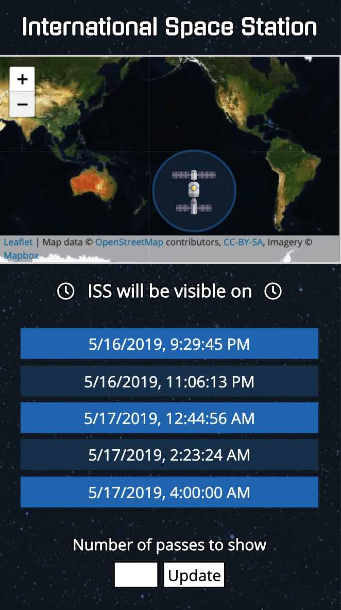

# ISS-Locator   
Find out the next time the International Space Station will be visible from your location as the map live-tracks the ISS.  

## Technology
This app uses data from the [Open Notify ISS API](http://open-notify.org/), [Leaflet](https://leafletjs.com/), [Mapbox](https://www.mapbox.com/), and the [Zip Code API](https://www.zipcodeapi.com/). It was written using HTML, CSS, JavaScript, and jQuery.

## Live Page
[https://lsauchter.github.io/ISS-Locator/](https://lsauchter.github.io/ISS-Locator/)

